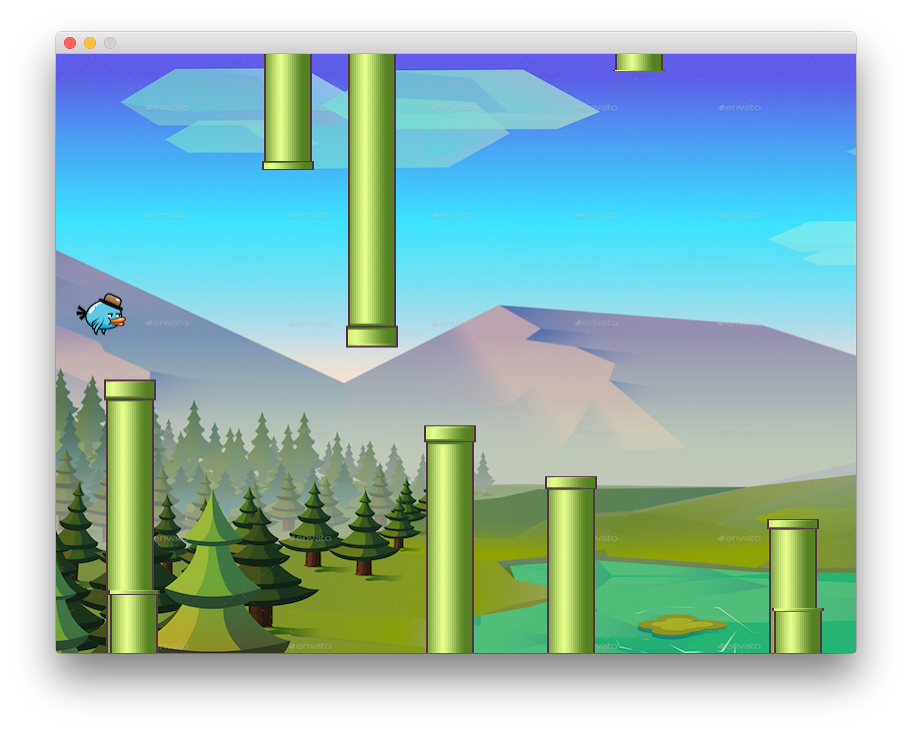

# Flappy Gopher

My own flappy bird built during Golab 2017.

All credit goes to the fantastic teacher of the training,
[Sab](https://github.com/shabinesh).

All the graphics are generated with https://github.com/veandco/go-sdl2,
a binding of SDL in Go.

### Disclaimer

This is not an official Google product (experimental or otherwise), it is just
code that happens to be owned by Google.
